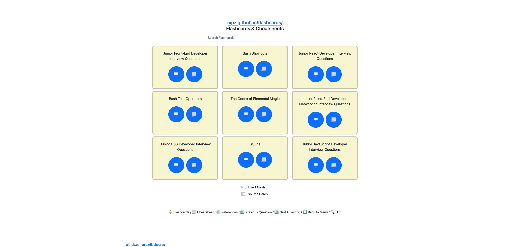
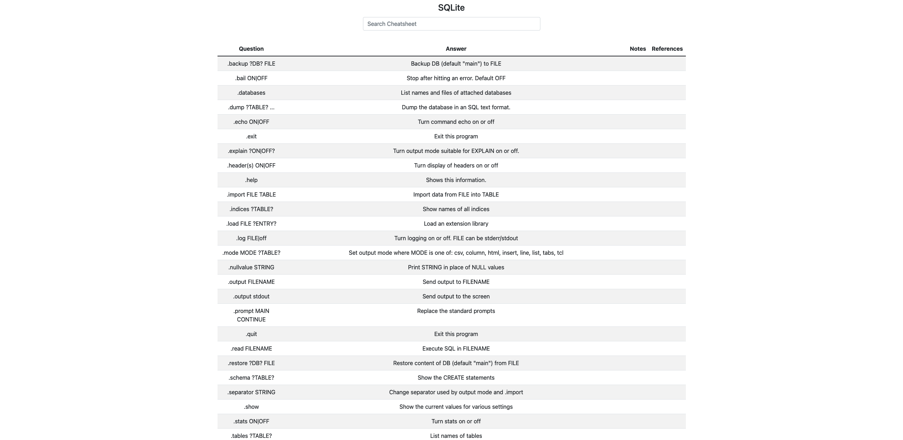
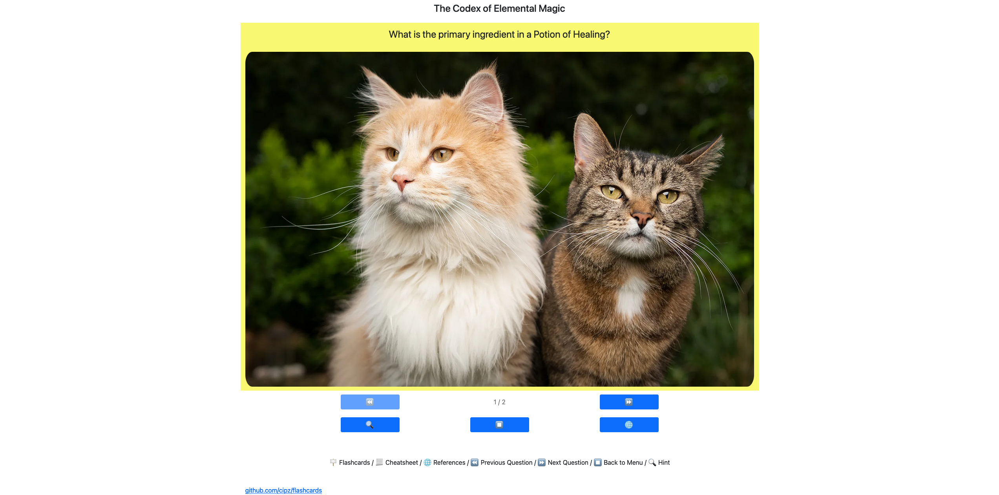
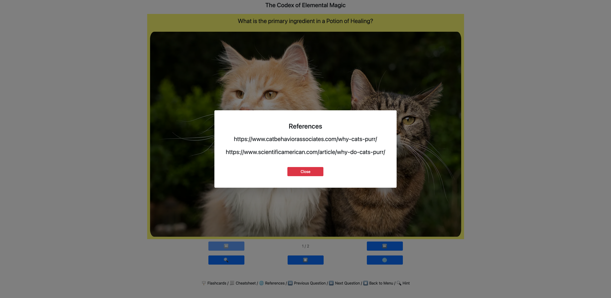
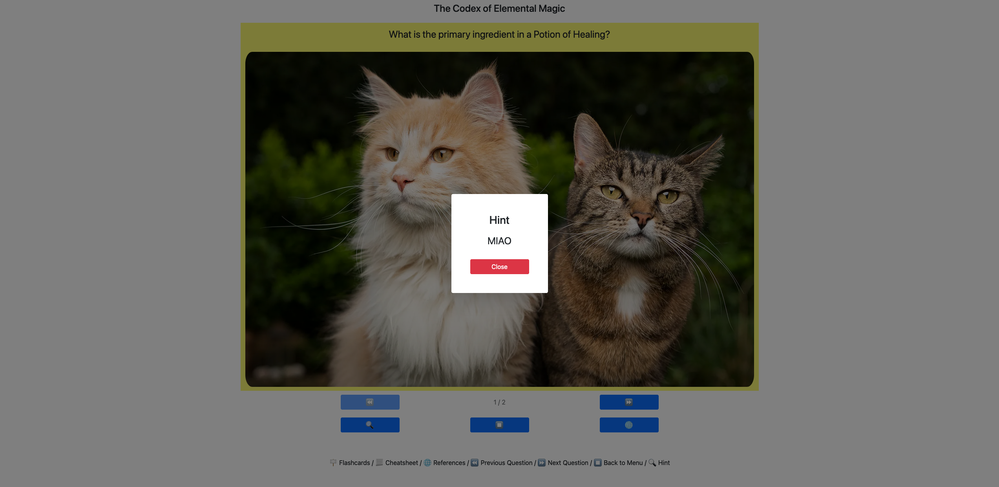

# [flashcards.wtf](https://flashcards.wtf)

Yet another flashcard visualizer, which also shows the entries as a cheatsheet.



## Why thought?

I was looking for a very simple service that would allow me to keep track of concepts I want to fix in mind.
The requirements: clean interface, available from anywhere and from any device, easy to define the flashcards in code.

I ended up making it myself.

It's currently hosted on GitHub pages and accessible from [flashcards.wtf](https://flashcards.wtf) and [cipz.github.io/flashcards](https://cipz.github.io/flashcards).

## Features and functionality

This single page application starts by showing a list of all the possible flashcards decks that are currently listed in the `flashcards` folder in this repository.

Here is a legend of what each button stands for:

    🪧 Flashcards / 📃 Cheatsheet / 🌐 References / ⏪️ Previous Question / ⏩️ Next Question / ⏹️ Back to Menu / 🔍 Hint

## Flashcards

> A flashcard or flash card is a card bearing information on both sides, which is intended to be used as an aid in memorization. [Wikipedia](https://en.wikipedia.org/wiki/Flashcard)

By clicking on the 🪧 button for a flashcards deck, the page will reload with a `cardFile` parameter, specifying what deck you want to load.

This also means that you are not tied to the files in the flashcards folder, but you can simply request to load an external file (even local), as long as it is in the correct format.

From the menu page, the one with no parameters passed to it, it's also possible to choose if you want to invert the flashcards by displaying the answer at first and / or to shuffle them.

## Cheatsheets

> A cheat sheet (also cheatsheet) or crib sheet is a concise set of notes used for quick reference. [Wikipedia](https://en.wikipedia.org/wiki/Cheat_sheet)

By clicking on the 📃 button for a flashcard deck, the page will reload with the `cheatsheet` parameter, a boolean that when `true` will render the file in a tabular structure, thus showing it as a cheatsheet.



### Images

There is the possibility to have a mix of text and images in the flashcards deck.
This is done by specifying a link to the image that you want embedded in your question and answer cards. 



### References and hints

Each card can have a hint and a list of references.
These are simply displayed as overlays.




## Structure

- `index.html`: contains the structure of the page;
- `app.js`: file containing all the JavaScript logic;
- `style.css`: although all the components are mostly styled using Bootstrap, there is some custom styling;
- `manifest.json`: file that contains the reference to all the flashcard decks in the repository;
- `flascards/`: folder containing all the flashcards files;
- `manifest_gen.py`: Python script which gets invoked at each push. It parses all the `json` files in the `flashcards` directory and validates the formatting. If the formatting is not correct, the pipeline will fail.
 
## Flashcards format

The flashcards files are stored in `json` format in the `flashcards` folder and each follow the format in the [reference_format.json](reference_format.json) file:

```json
{
  "title": "",
  "sources": ["", ""],
  "cards": [
    {
      "question": "",
      "answer": "",
      "category": "",
      "hint": "",
      "notes": "",
      "question_image": "URL",
      "answer_image": "URL",
      "references": ["", ""]
    }
  ]
}
```

## Contributing

The more the marrier.
It would be nice to see the flashcards decks being contributed by other individuals that think alike.

### Adding your own deck

You can add a new flashcards deck by copying the flashcards format mentioned above.

### Automation

If you want to contribute to the repository by adding a new flashcards file as mentioned in the previous paragraph, this will be added to the manifest file by a GitHub action that detects the `json` files in the `flashcards` folder, validate the schema and commit the new `manifest.json` file. If the flashcards file is incorrectly formatted, the pipeline will fail.
